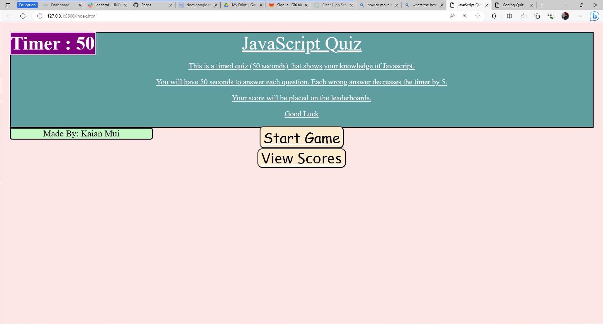

# Challenge-2

## User Story
AS A coding boot camp student
I WANT to take a timed quiz on JavaScript fundamentals that stores high scores
SO THAT I can gauge my progress compared to my peers

## Description
A quiz that test the knowledge of the players of the fundamentals of Javascript. Shows the users score so they compare with other players.

## Usage
<ul> 
    <li> Tests students on their knowledge on JavaScript </li>
    <li> Keeps track of record to see if there is any improvement and accuracy.</li>
    <li>Times the player so they only have limited time to answer.</li>
    <li>Can compete with others to see who gains the highest score.</li>

</ul>

## Deployed Site
[JavaScript Quiz](https://muisagara.github.io/Challenge-4/)

[Github](https://github.com/Muisagara/Challenge-4)

## Screenshots
()

## Credited Sources
-[question.js](/UNCC-VIRT-FSF-PT-07-2023-U-LOLC/04-Web-APIs/02-Challenge/Main/assets/js/logic.js/) code used as a refrence to begin my questions and answers.

-[logic.js](/UNCC-VIRT-FSF-PT-07-2023-U-LOLC/03-JavaScript/02-Challenge/Main/script.js) code used as a refrence to understand functions and variables. Code taken from 19-33 ,but improved to fit the Assignment.

I received assistance from an AI Learning Assistant while working on this code.
